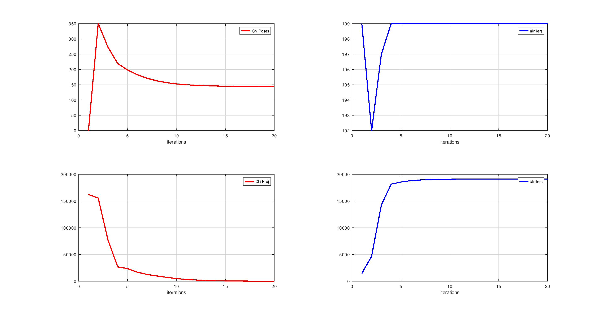
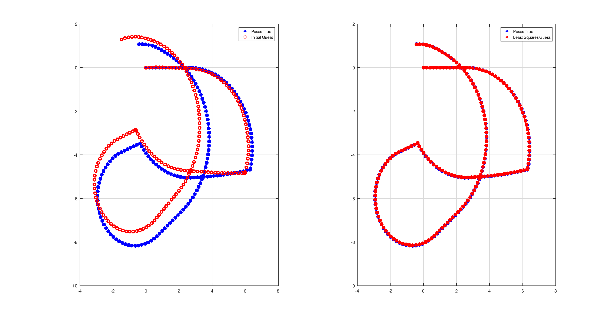
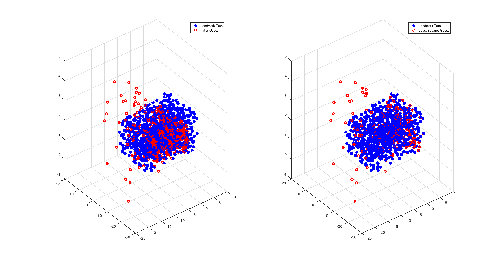
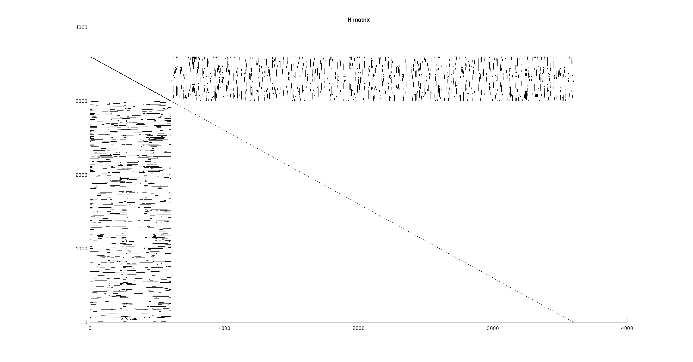

# PLANAR MONOCULAR SLAM

The two main phases of the project were to build a triangulation engine and to build the Total Least Squares machine in order to solve the ICP problem given the noisy odometry and a set of world points obtained through the previous triangulation step.

# Triangulation
The way I approached the triangulation problem was by building a map object containing all the associations between the poses and the landmark measurements from the camera.
Each pose has associated a number of {key,value} pairs equal to the number of measurements from that specific pose. The keys represent the real landmark ids thanks to the known data association, while the values are the $p=[u, v]^T$ measurements in the image plane.
I assumed known the total number of landmarks to simplify the initial allocation but it was certainly not necessary.
The triangulation step is performed using the multi-view DLT linear algorithm, thus solving the $AX = 0$ linear system by finding the eigenvector associated with the lowest value eigenvalue of the $V$ matrix (the last column of $V$) obtained via SVD on $A$. I built the $A$ matrix by stacking the homogeneous equations  $u P_3 - P_1$ and  $v P_3 - P_2$  where $P_1$, $P_2$ and $P_3$ are the columns of the projection matrix $KXp$.
I chose to filter out the points with less than 4 measurements in my final simulations, as the 2 and 3-view triangulations gave rise to outliers which more often than not end up outside of the camera boundaries during the reprojections, and end up not having any effect on the convergence of the pose.

# Bundle Adjustment
The Total Least Squares algorithm acts on pose-pose and pose-projection, as the data does not have $\R^3$ landmark measurements in the world. I chose to build up the pose-pose measurements on pairs of subsequent poses i, j where j = i + 1, as the data did not explicitly provide the relative odometry measures between one pose to the other but only the total rototranslations with respect to the origin.
The pose errors and jacobians were implemented by using the chordal distance to avoid implementing the boxminus operator. As the poses are in $SE(2)$ I only considered $x$, $y$ and $\alpha_z$ components when building the jacobians.
The same applies to the projection part, in which the robot side of the jacobian only considers the columns associated with $x$, $y$ and $\alpha_z$.
When calculating the prediction on the projections, any point outside of the image boundaries or camera depth range gets discarded and does not contribute to that step's error and jacobian.

Robot pose operations are executed using $SE(3)$ homogeneous transformations by fixing the $z$ component and limiting the rotations around the $z$ axis, thus only v2t and t2v methods transforming $SE(2)$ vectors to $SE(3)$ matrices and vice versa were needed.

As some landmarks are never seen, a nonzero damping is necessary in order to avoid a singular Hessian matrix due to zeroed landmark-landmark jacobians.

The perturbation vector considers again SE(2) poses and so its total length is 3*(num_poses + num_landmarks).

Lowering the kernel threshold seems to give some negligible improvements in the map estimation, though higher values do not hinder the convergence in any way. Values as high as $10^3$ provide almost identical results to the ones provided below.
I found the framework to be robust enough to find a great solution given a good enough initial estimate of the landmarks in the world. The presence of outliers does not in fact influence the final result as there are enough good measurements to make up for the noise.

When calculating the MSE on the landmarks I do not consider unseen nor discarded points, which are identified as $[0 ,0, -1]^T$.

# LATEST SIMULATION PARAMETERS

kernel_threshold = 1e1

damping = 	   1 	(required)

num_iterations =   20

# PRIOR ERRORS
landmark MSE initial guess: 1.53856

pose rotation MSE initial guess: 0.0119705

pose translation MSE initial guess: 0.0122911

# POSTERIOR ERRORS

landmark MSE after BA: 0.340098

pose rotation MSE after BA: 1.26684e-05

pose translation MSE after BA: 0.000599146

# PLOTS

 
